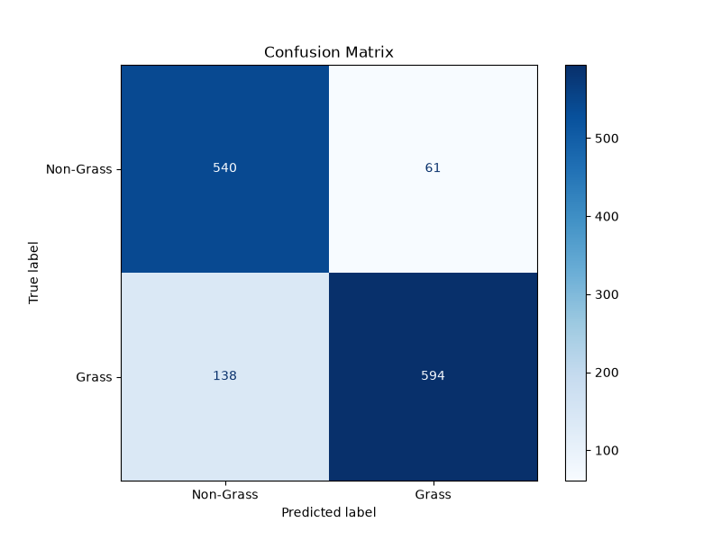
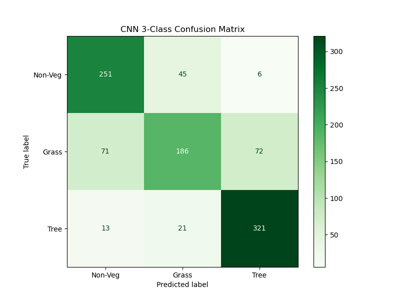
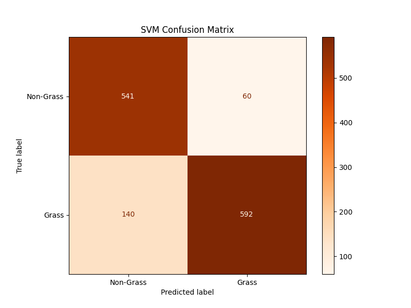

# Sentinel Grass Classifier


A backend service that processes Sentinel-2 satellite imagery via Google Earth Engine to compute Normalized Difference Vegetation Index (NDVI) features for downstream machine learning classification.

## Overview
This project provides an API to fetch and process multi-spectral satellite data based on geographic coordinates and time ranges. It automates the extraction of surface reflectance bands (Red, Near-Infrared), computes NDVI, and runs the data through a suite of localized Machine Learning models (Random Forest, 2D CNN, Support Vector Machine) to distinguish between grass and non-grass surfaces.

### Problem Solved
Manually fetching, filtering, and processing satellite imagery for vegetation mapping is time-consuming and computationally heavy. This API abstracts the Google Earth Engine (GEE) connection, automatically handling temporal and spatial filtering, cloud masking, and feature engineering (NDVI computation), exposing a simple REST endpoint for analysis.

## Key Features & Recent Updates
- **Interactive Map UI:** Replaced manual latitude/longitude entry with a clickable Leaflet.js map. Clicking anywhere on the map drops a marker and auto-fills the coordinates instantly.
- **Multi-Model Machine Learning Architecture:** Added a suite of robust ML models you can choose dynamically from the frontend:
  - **Random Forest (Baseline):** Ensemble-based pixel-by-pixel classification.
  - **2D Convolutional Neural Network (PyTorch):** Deep learning architecture utilizing 5x5 spatial patches for contextual evaluation. Data is automatically normalized for accurate convergence.
  - **Support Vector Machine (SVM):** A classic, rigorous mathematical model using an RBF kernel on scaled inputs.
- **Structured ML Directory:** Separated ML scripts into isolated folders (`random_forest/`, `cnn/`, `svm/`) and centralized generated confusion matrices and classification reports into a clean `ml/outputs/metrics/` directory.

## Model Performance Metrics

| Random Forest | 2D CNN (PyTorch) | Support Vector Machine |
|:---:|:---:|:---:|
|  |  |  |


## Architecture & Workflow
1. **Request:** Client submits coordinates (Decimal or DMS strings) and date range via REST API.
2. **Validation:** FastAPI and Pydantic securely validate and sanitize inputs.
3. **Data Acquisition (GEE):** Connects to the `COPERNICUS/S2_SR_HARMONIZED` dataset.
4. **Preprocessing:** Filters by bounds, dates, and `< 20%` cloud cover. Selects median temporal composite, enforcing a native 10m scale.
5. **Feature Engineering:** Computes NDVI using the standard formula `(NIR - Red) / (NIR + Red)`.
6. **ML Inference:** Processes the grid through one of three selectable Machine Learning models (Random Forest, PyTorch 2D CNN, or SVM) to predict vegetation confidence.
7. **Logging:** Reverse geocodes the coordinates (via Nominatim) and logs query metadata to a local CSV asynchronously.
8. **Response:** Returns execution status, ML confidence metrics, and an authenticated URL to the generated visualization thumbnail.

## Tech Stack
- **Framework:** FastAPI
- **Data Source:** Google Earth Engine Python API (`earthengine-api`)
- **Machine Learning:** Scikit-Learn (Random Forest, SVM), PyTorch (2D CNN)
- **Geocoding:** GeoPy (Nominatim)
- **Validation:** Pydantic
- **Environment Management:** Python `venv`, `python-dotenv`

## Project Structure
```text
sentinel-grass-classifier/
├── backend/
│   ├── api.py               # FastAPI entry point, dependency injection, and route handlers
│   ├── core.py              # Earth Engine integration, data fetching, and NDVI math
│   ├── gee_auth.py          # Script to handle local OAuth2 flow for GEE
│   ├── utils.py             # Asynchronous CSV query logging and reverse geocoding
│   ├── requirements.txt     # Python dependencies
│   └── .env.example         # Template for environment variables
├── ml/
│   ├── data/                # Generated datasets (1D pixels, 2D patches)
│   ├── models/              # Trained ML models (.pkl, .pth)
│   ├── outputs/             # Generated visualizations and prediction maps
│   │   └── metrics/         # Confusion matrices, JSON metrics, and classification reports
│   ├── random_forest/       # Random Forest model training and evaluation scripts
│   ├── cnn/                 # PyTorch 2D Convolutional Neural Network scripts
│   ├── svm/                 # Support Vector Machine training and evaluation scripts
│   ├── ml_predict.py        # Centralized inference script used by the backend
│   └── visualize.py         # Matplotlib logic to generate colored segmentation maps
├── Frontend/
│   ├── index.html           # Web UI layout
│   ├── style.css            # Glassmorphism dark-mode styling
│   └── app.js               # API communication logic
├── work_distribution.md     # Team responsibility breakdown
└── README.md                # Project documentation
```

## Setup Instructions

### Prerequisites
- Python 3.10+
- A Google Cloud Project registered for Earth Engine API access.

### Installation
1. Clone the repository and navigate to the backend directory:
   ```bash
   cd backend
   ```
2. Create and activate a virtual environment:
   ```bash
   python -m venv venv
   # Windows:
   .\venv\Scripts\activate
   # macOS/Linux:
   source venv/bin/activate
   ```
3. Install dependencies:
   ```bash
   pip install -r requirements.txt
   ```

### Environment Variables & Authentication
Instead of hardcoding service accounts, this project relies on local OAuth2 for Earth Engine access to prevent credential leakage.

1. Run the authentication script:
   ```bash
   python gee_auth.py
   ```
2. Follow the browser prompt to authenticate with your Google account. The credentials will be stored locally in `~/.config/earthengine/credentials` (ignored by git).

*(Note: If deploying to a server, you must provide a Service Account JSON key via `.env` instead).*

## Running Locally

### 1. Start the Backend API
Start the FastAPI server with Uvicorn:
```bash
cd backend
uvicorn api:app --reload
```
The API will be accessible at `http://localhost:8000`. Swagger documentation is available at `http://localhost:8000/docs`.

### 2. Start the Frontend Dashboard
You can run the web UI using Python's built-in HTTP server. Open a **new** terminal window:
```bash
cd frontend
python -m http.server 3000
```
Open your browser and navigate to `http://localhost:3000`.

## API Reference

### `POST /predict`
Analyzes vegetation over a specified geographic point and time range.

**Request Body:**
```json
{
  "latitude": "40°46'52.35\"N",
  "longitude": "73°57'57.25\"W",
  "date_start": "2024-01-01",
  "date_end": "2024-05-30",
  "model_type": "cnn_2d"
}
```
*(Note: You can provide standard Decimal floats instead of DMS strings. Valid `model_type` values are `random_forest`, `cnn_2d`, or `svm`).*

**Success Response (200 OK):**
```json
{
  "status": "success",
  "message": "Data processed successfully.",
  "prediction": "Vegetation Detected",
  "is_grass": true,
  "confidence": 91.5,
  "grass_percentage": 100.0,
  "ndvi_mean": 0.45,
  "visualization_path": "http://127.0.0.1:8000/outputs/prediction_20260602.png",
  "ndvi_thumbnail_url": "https://earthengine.googleapis.com/v1/projects/.../thumbnails/...",
  "coordinates": {
    "lat": 40.781208,
    "lon": -73.965902
  }
}
```

## Engineering Decisions
- **Security & Hardening:** Fully protected against DDoS and malformed injections via `slowapi` rate limiting (10 req/min), strict Pydantic anti-mass-assignment configurations (`extra="forbid"`), and synchronous Google Earth Engine thread-pool offloading.
- **DMS Coordinate Support:** Built-in regex parsing allows users to seamlessly paste standard GPS Degrees, Minutes, Seconds strings without manual conversion.
- **FastAPI BackgroundTasks:** Used for the `log_query_to_csv` function to ensure that network latency from the reverse geocoding API (Nominatim) does not block the main HTTP response to the client.
- **Median Compositing:** Applied `.median()` to the image collection while actively enforcing the native 10-meter EPSG:3857 projection scale to prevent GEE from returning empty 1-degree pixels.

## Limitations & Future Improvements
- **Rate Limiting (Internal):** Geocoding relies on Nominatim's public API, which is strictly rate-limited (1 req/sec). A production environment should swap this for a paid provider or internal lookup table.
- **Spatial Expansion:** The API currently expects point coordinates. It should be expanded to accept GeoJSON polygons for bounding-box analysis.